  
#  &nbsp;Hi There . . .

I am U Sastha Ruban. Right now I spend most of my time learning networking, Linux, packet analysis, system internals, and cybersecurity concepts while slowly working toward my CCNA. Most of the things here are built while I’m actively learning, testing ideas, breaking things, fixing them again

This repository is basically a collection of whatever I end up building during that process. Some projects are small tools, some become bigger experiments, and some are probably never getting finished. Alongside networking and Linux Ricing, I still work on game development as a side hobby whenever I feel like taking a break from systems and low-level work.

#

**References :**  I try my best to drop links to the documentation, RFCs, videos, articles, and research material used during development.
#

Most of the things here are built mainly out of curiosity, experimentation, and the habit of wanting to understand how things actually work internally instead of only using them from the outside.

#

<table>
<tr>

<td width="60%">

</td>

<td width="40%">

</td>

</tr>
</table>

